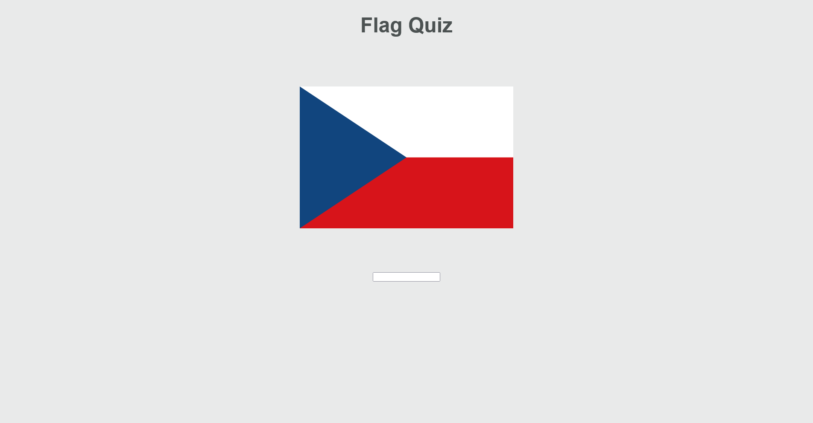

# Flag Quiz

A game where you try to guess a flag by the name of the country representing that flag.

## Future plans
- Add game over screen
- Add point system
- Randomizer (i.e. guess set of random flags from different continents)
- Multiplayer? (server implementation, versus)

## Requirements
- Minimum supported version: Rust 1.7x.x
- `Trunk` (WASM web application bundler for Rust) `cargo install --locked trunk`
- Add WebAssemly as Rust's compilation target `rustup target add wasm32-unknown-unknown`
- `cargo install -f wasm-bindgen-cli`
## Usage
1. `cargo build`
2. `trunk build`
3. `trunk serve`

